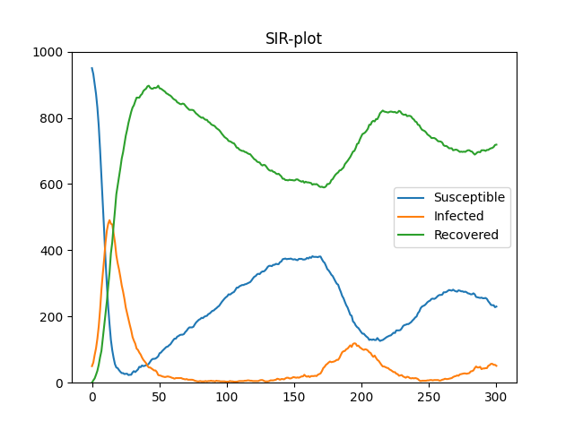
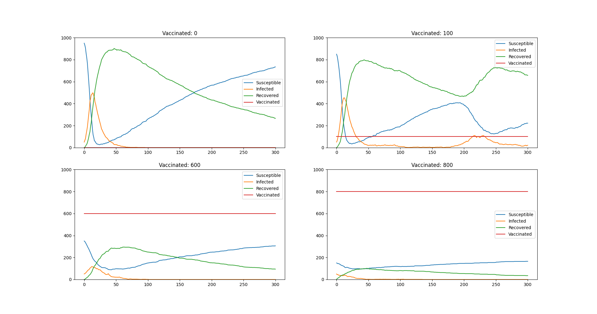

# SIR
Project from the course TMA4265 Stochastic Modelling  at NTNU 

### The SIRV model

This project revolves around a model for simulating an outbreak of measles. We simulate this using a 
discrete time Markov chain. In addition to the Markov chain we have implemented methods for gathering
data on how the model behaves with different initial conditions and probabilites of infection and recovery.  
The class `SIR` has not been written for extensibility beyond the bounds of the project. Modifing this model is therefore not recommended without rewriting the entire class `SIR`.  
  
Below are some plots created by this model using the method `graphSIR`.  
  
  
  
